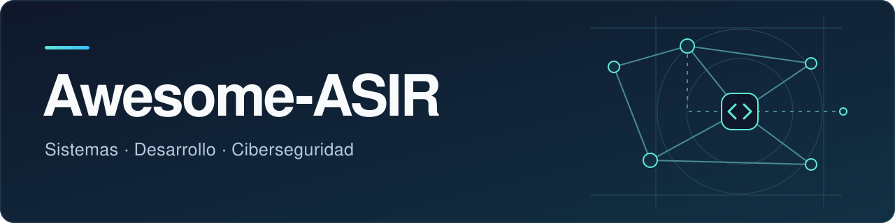

# Awesome-ASIR

Catálogo curado para **Informática y Comunicaciones** (SMR, ASIR, DAM, DAW, CETI, IABD, DVRV) y telecomunicaciones de **Electricidad y Electrónica** (ITEL, STI). Recursos en español cuando hay opción comparable; el inglés se indica en cada ficha.

[Categorías](#categorias) · [Titulaciones](#titulaciones) · [Itinerarios](#itinerarios) · [Etiquetas](docs/ETIQUETAS.md) · [Contribuir](#contribuir)

---

## Contenido

| Área | Fichas |
| --- | ---: |
| [Sistemas y bastionado](recursos/sistemas.md) | 10 |
| [Redes e Internet](recursos/redes.md) | 7 |
| [Telecomunicaciones](recursos/telecomunicaciones.md) | 6 |
| [Cloud y despliegue](recursos/cloud.md) | 8 |
| [Desarrollo y bases de datos](recursos/desarrollo.md) | 7 |
| [Seguridad ofensiva y defensiva](recursos/ciberseguridad.md) | 8 |
| [Gobierno, formación y normativa](recursos/gobierno.md) | 11 |

## Por titulación

| Titulación | Apuntes | Proyectos |
| --- | --- | --- |
| **SMR** · Sistemas Microinformáticos y Redes | [SMR](recursos/apuntes.md#smr) | — |
| **ASIR** · Administración de Sistemas Informáticos en Red | [ASIR](recursos/apuntes.md#asir) | [Proyectos](recursos/proyectos.md) |
| **DAM** · Desarrollo de Aplicaciones Multiplataforma | [DAM](recursos/apuntes.md#dam) | [Proyectos](recursos/proyectos.md) |
| **DAW** · Desarrollo de Aplicaciones Web | [DAW](recursos/apuntes.md#daw) | [Proyectos](recursos/proyectos.md) |
| **CETI** · Ciberseguridad en entornos TI | [CETI](recursos/apuntes.md#ceti) | — |
| **IABD** · Inteligencia Artificial y Big Data | [IABD](recursos/apuntes.md#iabd) | — |
| **DVRV** · Desarrollo de Videojuegos y RV | [DVRV](recursos/apuntes.md#dvrv) | — |
| **ITEL** · Instalaciones de Telecomunicaciones (GM) | [ITEL](recursos/apuntes.md#itel) | — |
| **STI** · Sistemas de Telecomunicaciones e Informáticos (GS) | [STI](recursos/apuntes.md#sti) | — |

## Por dónde empezar

Rutas editoriales: **base → práctica → profundización**.

### ASIR

[NetAcad](recursos/redes.md#cisco-netacad) → [Ubuntu](recursos/sistemas.md#ubuntu-server) → [José Juan Sánchez](recursos/desarrollo.md#jose-juan-sanchez) → [SadServers](recursos/sistemas.md#sadservers) → [CIS](recursos/sistemas.md#cis-benchmarks) → [Wireshark](recursos/redes.md#wireshark)

### DAW

[GitHub Skills](recursos/desarrollo.md#github-skills) → [José Juan Sánchez](recursos/desarrollo.md#jose-juan-sanchez) → [MDN HTTP](recursos/redes.md#mdn-http) → [Cloudflare Learning](recursos/redes.md#cloudflare-learning) → [OWASP](recursos/ciberseguridad.md#owasp-wstg) → [PortSwigger](recursos/ciberseguridad.md#portswigger)

### DAM

[GitHub Skills](recursos/desarrollo.md#github-skills) → [Oracle Academy](recursos/desarrollo.md#oracle-academy) → [Microsoft Learn](recursos/cloud.md#microsoft-learn) → [PostgreSQL](recursos/desarrollo.md#postgresql) → [pwn.college](recursos/ciberseguridad.md#pwn-college)

### CETI

[NetAcad](recursos/redes.md#cisco-netacad) → [Ubuntu](recursos/sistemas.md#ubuntu-server) → [CIS](recursos/sistemas.md#cis-benchmarks) → [PortSwigger](recursos/ciberseguridad.md#portswigger) → [CyberDefenders](recursos/ciberseguridad.md#cyberdefenders) → [ÁNGELES](recursos/gobierno.md#angeles) → [MITRE ATT&CK](recursos/ciberseguridad.md#mitre-attack)

### SMR

[Apuntes SMR](recursos/apuntes.md#smr) · [redes](recursos/redes.md) · [sistemas](recursos/sistemas.md)

### IABD · DVRV

[IABD](recursos/apuntes.md#iabd) · [DVRV](recursos/apuntes.md#dvrv)

### ITEL

[ICT](recursos/telecomunicaciones.md#boe-ict) → [procedimientos](recursos/telecomunicaciones.md#ministerio-ict) → [NetAcad](recursos/redes.md#cisco-netacad) → [Wireshark](recursos/redes.md#wireshark) → [FOA](recursos/telecomunicaciones.md#foa) → [espectro](recursos/telecomunicaciones.md#boe-radio)

### STI

[ICT](recursos/telecomunicaciones.md#boe-ict) → [Televés ICT2](recursos/telecomunicaciones.md#televes-ict2) → [NetAcad](recursos/redes.md#cisco-netacad) → [FOA](recursos/telecomunicaciones.md#foa) → [Wireshark](recursos/redes.md#wireshark) → [Asterisk](recursos/telecomunicaciones.md#asterisk) → [espectro](recursos/telecomunicaciones.md#boe-radio) → [Ubuntu](recursos/sistemas.md#ubuntu-server)

## Contribuir

[Criterios](docs/CRITERIOS.md) · [código de conducta](CODE_OF_CONDUCT.md) · [guía](CONTRIBUTING.md) · [mantenimiento](docs/MANTENIMIENTO.md) · [etiquetas](docs/ETIQUETAS.md) · licencia [CC BY-SA 4.0](LICENSE.md)
